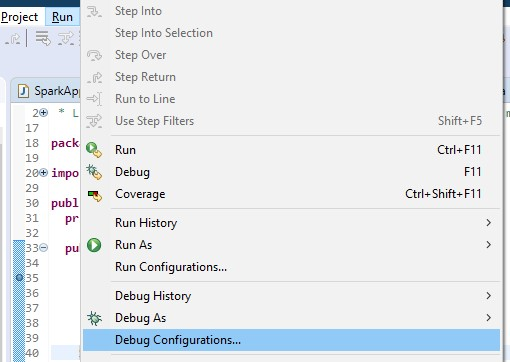
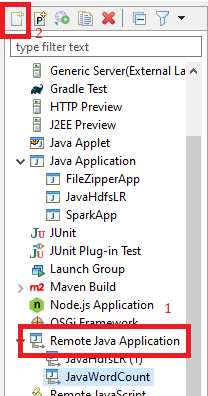
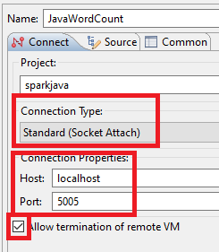
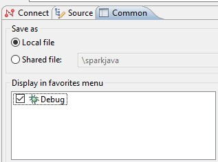

## Encryption using AES
File pom.xml
```xml
<!-- https://mvnrepository.com/artifact/commons-codec/commons-codec -->
	<dependency>
	    <groupId>commons-codec</groupId>
	    <artifactId>commons-codec</artifactId>
	    <version>1.11</version>
	</dependency>
```

```java
import javax.crypto.Cipher;
import javax.crypto.spec.IvParameterSpec;
import javax.crypto.spec.SecretKeySpec;

import org.apache.commons.codec.binary.Base64;

public class Encryption {
	private static final String KEY = "Bar12345Bar12345"; // 128 bit key
	private static final String INIT_VECTOR = "RandomInitVector"; // 16 bytes IV
	
	public static String encrypt(String key, String initVector, String value) {
        try {
            IvParameterSpec iv = new IvParameterSpec(initVector.getBytes("UTF-8"));
            SecretKeySpec skeySpec = new SecretKeySpec(key.getBytes("UTF-8"), "AES");

            Cipher cipher = Cipher.getInstance("AES/CBC/PKCS5PADDING");
            cipher.init(Cipher.ENCRYPT_MODE, skeySpec, iv);

            byte[] encrypted = cipher.doFinal(value.getBytes());

            return Base64.encodeBase64String(encrypted);
        } catch (Exception ex) {
            ex.printStackTrace();
        }

        return null;
    }

    public static String decrypt(String key, String initVector, String encrypted) {
        try {
            IvParameterSpec iv = new IvParameterSpec(initVector.getBytes("UTF-8"));
            SecretKeySpec skeySpec = new SecretKeySpec(key.getBytes("UTF-8"), "AES");

            Cipher cipher = Cipher.getInstance("AES/CBC/PKCS5PADDING");
            cipher.init(Cipher.DECRYPT_MODE, skeySpec, iv);

            byte[] original = cipher.doFinal(Base64.decodeBase64(encrypted));

            return new String(original);
        } catch (Exception ex) {
            ex.printStackTrace();
        }

        return null;
    }
    
    public static String encrypt(String value) {
    	return encrypt(KEY, INIT_VECTOR, value);
    }
    
    public static String decrypt(String value) {
    	return decrypt(KEY, INIT_VECTOR, value);
    }
}
```

## Send Http request
```java
public static String sendHttpRequest(String url, String method, HashMap<String, String> params, String data) {
		HttpURLConnection connection = null;

		try {
			// Create connection
			URL urlObj = new URL(url);
			connection = (HttpURLConnection) urlObj.openConnection();

			if (method != null && !"get".equalsIgnoreCase(method)) {
				connection.setRequestMethod(method);
			}

			/*
			 * connection.setRequestProperty("Content-Type",
			 * "application/x-www-form-urlencoded");
			 */

			/*
			 * connection.setRequestProperty("Content-Length",
			 * Integer.toString(urlParameters.getBytes().length));
			 * connection.setRequestProperty("Content-Language", "en-US");
			 */

			if (params != null && !params.isEmpty()) {
				Set<String> keySet = params.keySet();
				for(String key: keySet) {
					if(Utils.isNullOrEmpty(key)) {
						continue;
					}
					String value = params.get(key);
					connection.setRequestProperty(key, value);
				}
			}
			connection.setUseCaches(false);
			
			// Send request
			if ("POST".equals(method) || "post".equals(method)) {
				connection.setDoOutput(true);
				DataOutputStream wr = new DataOutputStream(connection.getOutputStream());
				if (data != null) {
					wr.writeBytes(data);
				}
				wr.close();
			}
			// Get Response
			InputStream is = connection.getInputStream();
			BufferedReader rd = new BufferedReader(new InputStreamReader(is));
			StringBuilder response = new StringBuilder(); // or StringBuffer if Java version 5+
			String line;
			while ((line = rd.readLine()) != null) {
				response.append(line);
				response.append('\r');
			}
			rd.close();
						
			return response.toString();
		} catch (IOException e) {
			try {
				InputStream is = connection.getErrorStream();
				BufferedReader rd = new BufferedReader(new InputStreamReader(is));
				StringBuilder response = new StringBuilder();
				String line;
				while ((line = rd.readLine()) != null) {
					response.append(line);
					response.append('\r');
				}
				rd.close();
				return response.toString();
			} catch (Exception e2) {
				e2.printStackTrace();
				return null;
			}
		} catch (Exception e) {
			e.printStackTrace();
			return null;
		} finally {
			if (connection != null) {
				connection.disconnect();
			}
		}
	}
	
	public static String sendGetRequest(String url, HashMap<String, String> params) {
		return sendHttpRequest(url, "GET", params, null);
	}
	public static String sendGetRequest(String url) {
		return sendHttpRequest(url, "GET", null, null);
	}
	public static String sendPostRequest(String url, HashMap<String, String> params, String data) {
		return sendHttpRequest(url, "POST", params, data);
	}
	
	public static void main(String[] args) {
		System.out.println(sendPostRequest("http://localhost:8080/mavenTest3/TestServlet", null, null));
	}

```

### UTF 8 Encoding
```java
// Send request			
			if ("POST".equals(method) || "post".equals(method)) {			
				connection.setDoOutput(true);
				BufferedWriter bw = new BufferedWriter(new OutputStreamWriter(connection.getOutputStream(), "UTF-8"));
				if (data != null) {
					bw.write(data);
				}
				bw.flush();
				bw.close();
			}			

			// Get Response
			InputStream is = connection.getInputStream();
			BufferedReader rd = new BufferedReader(new InputStreamReader(is, "UTF-8"));
			StringBuilder response = new StringBuilder();
```

## Send multipart file
```java
import java.io.BufferedReader;
import java.io.File;
import java.io.FileInputStream;
import java.io.IOException;
import java.io.InputStream;
import java.io.InputStreamReader;
import java.io.OutputStream;
import java.io.OutputStreamWriter;
import java.io.PrintWriter;
import java.net.HttpURLConnection;
import java.net.URL;
import java.net.URLConnection;
import java.util.ArrayList;
import java.util.HashMap;
import java.util.List;
import java.util.Set;
 
/**
 * This utility class provides an abstraction layer for sending multipart HTTP
 * POST requests to a web server.
 * @author 
 *
 */
public class MultipartUtils {
    private final String boundary;
    private static final String LINE_FEED = "\r\n";
    private HttpURLConnection httpConn;
    private String charset;
    private OutputStream outputStream;
    private PrintWriter writer;
 
    /**
     * This constructor initializes a new HTTP POST request with content type
     * is set to multipart/form-data
     * @param requestURL
     * @param charset
     * @throws IOException
     */
    public MultipartUtils(String requestURL, String charset, HashMap<String, String> headers)
            throws IOException {
        this.charset = charset;
         
        // creates a unique boundary based on time stamp
        boundary = "===" + System.currentTimeMillis() + "===";
         
        URL url = new URL(requestURL);
        httpConn = (HttpURLConnection) url.openConnection();
        httpConn.setUseCaches(false);
        httpConn.setDoOutput(true); // indicates POST method
        httpConn.setDoInput(true);
        httpConn.setRequestProperty("Content-Type",
                "multipart/form-data; boundary=" + boundary);
        
        if (headers != null && !headers.isEmpty()) {
			Set<String> keySet = headers.keySet();
			for (String key : keySet) {
				if (Utils.isNullOrEmpty(key)) {
					continue;
				}
				String value = headers.get(key);
				httpConn.setRequestProperty(key, value);
			}
		}
        
        outputStream = httpConn.getOutputStream();
        writer = new PrintWriter(new OutputStreamWriter(outputStream, charset),
                true);
    }
 
    /**
     * Adds a form field to the request
     * @param name field name
     * @param value field value
     */
    public void addFormField(String name, String value) {
        writer.append("--" + boundary).append(LINE_FEED);
        writer.append("Content-Disposition: form-data; name=\"" + name + "\"")
                .append(LINE_FEED);
        writer.append("Content-Type: text/plain; charset=" + charset).append(
                LINE_FEED);
        writer.append(LINE_FEED);
        writer.append(value).append(LINE_FEED);
        writer.flush();
    }
 
    /**
     * Adds a upload file section to the request
     * @param fieldName name attribute in <input type="file" name="..." />
     * @param uploadFile a File to be uploaded
     * @throws IOException
     */
    public void addFilePart(String fieldName, File uploadFile)
            throws IOException {
        String fileName = uploadFile.getName();
        writer.append("--" + boundary).append(LINE_FEED);
        writer.append(
                "Content-Disposition: form-data; name=\"" + fieldName
                        + "\"; filename=\"" + fileName + "\"")
                .append(LINE_FEED);
        writer.append(
                "Content-Type: "
                        + URLConnection.guessContentTypeFromName(fileName))
                .append(LINE_FEED);
        writer.append("Content-Transfer-Encoding: binary").append(LINE_FEED);
        writer.append(LINE_FEED);
        writer.flush();
 
        FileInputStream inputStream = new FileInputStream(uploadFile);
        byte[] buffer = new byte[4096];
        int bytesRead = -1;
        while ((bytesRead = inputStream.read(buffer)) != -1) {
            outputStream.write(buffer, 0, bytesRead);
        }
        outputStream.flush();
        inputStream.close();
         
        writer.append(LINE_FEED);
        writer.flush();    
    }
 
    /**
     * Adds a header field to the request.
     * @param name - name of the header field
     * @param value - value of the header field
     */
    public void addHeaderField(String name, String value) {
        writer.append(name + ": " + value).append(LINE_FEED);
        writer.flush();
    }
     
    /**
     * Completes the request and receives response from the server.
     * @return a list of Strings as response in case the server returned
     * status OK, otherwise an exception is thrown.
     * @throws IOException
     */
    public List<String> send() throws IOException {
        List<String> response = new ArrayList<String>();
 
        writer.append(LINE_FEED).flush();
        writer.append("--" + boundary + "--").append(LINE_FEED);
        writer.close();
 
        // checks server's status code first
        int status = httpConn.getResponseCode();
        if (status == HttpURLConnection.HTTP_OK) {
            BufferedReader reader = new BufferedReader(new InputStreamReader(
                    httpConn.getInputStream()));
            String line = null;
            while ((line = reader.readLine()) != null) {
                response.add(line);
            }
            reader.close();
            httpConn.disconnect();
        } else {
        	InputStream is = httpConn.getErrorStream();
			BufferedReader reader = new BufferedReader(new InputStreamReader(is));
			String line;
			
			StringBuilder builder = new StringBuilder();
			while ((line = reader.readLine()) != null) {
				builder.append(line);
				builder.append("\r\n");
			}
			reader.close();
			httpConn.disconnect();
            throw new IOException("Server returned non-OK status: " + status + "\r\n"+builder.toString());
        }
 
        return response;
    }
}

String charset = "UTF-8";
        File uploadFile1 = new File("D:/NewsProject.war");
        //String requestURL = "http://localhost:8081/deploymanager/deploy/";
        String requestURL = "https://webgaddeployserver.azurewebsites.net/deploymanager/deploy/";
    	try {
    		MultipartUtils multipart = new MultipartUtils(requestURL, charset, header);
            
            //multipart.addHeaderField("Authorization", "Basic " + basicAuthorization);
             
            multipart.addFormField("deployPath", "/newsreader");
             
            multipart.addFilePart("warfile", uploadFile1);
 
            List<String> response = multipart.send();
             
            System.out.println("SERVER REPLIED:");
             
            for (String line : response) {
                System.out.println(line);
            }
            
			return;
		} catch (Exception e) {
			e.printStackTrace();
		}    	

```

## Read property value in resource file
```java
public static String readPropertyValue(String propertyFileName, String key) {
		try {
			ClassLoader classloader = Thread.currentThread().getContextClassLoader();
			InputStream is = classloader.getResourceAsStream(propertyFileName);
			
			Properties properties = new Properties();
			properties.load(is);
			return properties.getProperty(key);
		} catch (Exception e) {
			e.printStackTrace();
			return "";
		}		
	}

```

## InputStream to String
```java
public static String inputStreamToString(InputStream is) throws IOException {
		final int bufferSize = 1024;
		final char[] buffer = new char[bufferSize];
		final StringBuilder out = new StringBuilder();
		Reader in = new InputStreamReader(is, "UTF-8");
		for (;;) {
			int rsz = in.read(buffer, 0, buffer.length);
			if (rsz < 0)
				break;
			out.append(buffer, 0, rsz);
		}
		return out.toString();
	}

```

## BufferedReader to String
```java
public static String bufferedReaderToString(BufferedReader reader) throws IOException {
		StringBuffer jb = new StringBuffer();
		String line = null;
		while ((line = reader.readLine()) != null) {
			jb.append(line);
		}
		return jb.toString();
	}

```

## Add local jar file 
**Copy jar file to `lib\a.jar`**

**File pom.xml, add to `<build>`**
```xml
<plugins>
    	<plugin>
            <groupId>org.apache.maven.plugins</groupId>
            <artifactId>maven-install-plugin</artifactId>
            <version>2.5.2</version>            
            <executions>
                <execution>
                    <phase>initialize</phase>
                    <goals>
                        <goal>install-file</goal>
                    </goals>
                    <configuration>
                        <file>${basedir}/lib/a.jar</file>
                        <groupId>vn.com.webgad.library</groupId>
                        <artifactId>webgad-library</artifactId>
                        <version>0.0.1-SNAPSHOT</version>                        
                        <packaging>jar</packaging>                        
                    </configuration>
                </execution>
            </executions>
        </plugin>
    </plugins>

    <pluginManagement>
    	<plugins>
    		<!--This plugin's configuration is used to store Eclipse m2e settings only. It has no influence on the Maven build itself.-->
    		<plugin>
    			<groupId>org.eclipse.m2e</groupId>
    			<artifactId>lifecycle-mapping</artifactId>
    			<version>1.0.0</version>
    			<configuration>
    				<lifecycleMappingMetadata>
    					<pluginExecutions>
    						<pluginExecution>
    							<pluginExecutionFilter>
    								<groupId>
    									org.apache.maven.plugins
    								</groupId>
    								<artifactId>
    									maven-install-plugin
    								</artifactId>
    								<versionRange>
    									[2.5.2,)
    								</versionRange>
    								<goals>
    									<goal>install-file</goal>
    								</goals>
    							</pluginExecutionFilter>
    							<action>
    								<ignore></ignore>
    							</action>
    						</pluginExecution>
    					</pluginExecutions>
    				</lifecycleMappingMetadata>
    			</configuration>
    		</plugin>
    	</plugins>
    </pluginManagement>

```

**Add to dependencies**
```xml
<dependency>
	    <groupId>vn.com.webgad.library</groupId>
	    <artifactId>webgad-library</artifactId>
	    <version>0.0.1-SNAPSHOT</version>
	</dependency>

```

## Api return file
```java
@RequestMapping(value="/{id}/credential", method = RequestMethod.GET, produces = MediaType.APPLICATION_OCTET_STREAM_VALUE)
	public ResponseEntity<byte[]> getCredential(@PathVariable String id, HttpServletRequest request) {		
		try {
			
			String content ="abc";		
		    HttpHeaders headers = new HttpHeaders();
		    headers.setContentDisposition(ContentDisposition.parse("attachment; filename=\"webgadSecret.json\""));
		    
		    ResponseEntity<byte[]> responseEntity = new ResponseEntity<>(content.getBytes(), headers, HttpStatus.OK);
		    
		    return responseEntity;
	    } catch (Exception e) {
	    	e.printStackTrace();
			throw new BusinessException(MessageConst.E_UNEXPECTED_ERROR, HttpServletResponse.SC_INTERNAL_SERVER_ERROR);
		}
	}

```

## Debug remote application in Eclipse
### Debug general application
```bat
java -Xdebug -Xrunjdwp:transport=dt_socket,address=8998,server=y -jar myapp.jar
```

### Debug Spark application running Locally
Add config:
```bat
agentlib:jdwp=transport=dt_socket,server=y,suspend=y,address=5005
```

For example:
```bat
spark-submit --master local --conf spark.driver.extraJavaOptions=-agentlib:jdwp=transport=dt_socket,server=y,suspend=y,address=5005 --class org.apache.spark.examples.JavaWordCount spark-examples_2.12-3.0.1.jar
```

### Debug Spark application running on Remote server
Run command:
```bat
export SPARK_SUBMIT_OPTS=-agentlib:jdwp=transport=dt_socket,server=y,suspend=y,address=5050
```

### Configure Eclipse
1. Go to Run -> Debug Configurations
 
2. Create a new Remote Java Application configuration
 
3. Configure the remote application
 
4. If you would like to have this launch configuration in your favorites menu, In tab Common, check Debug
 